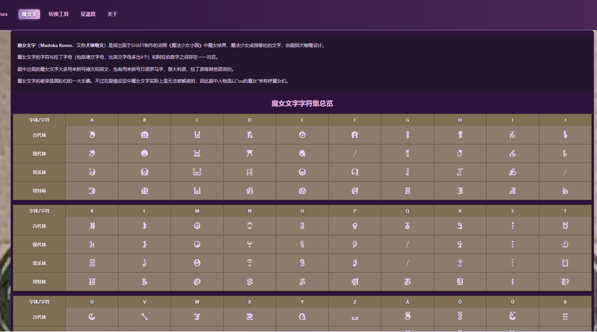
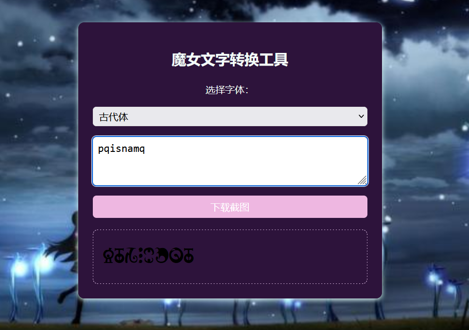
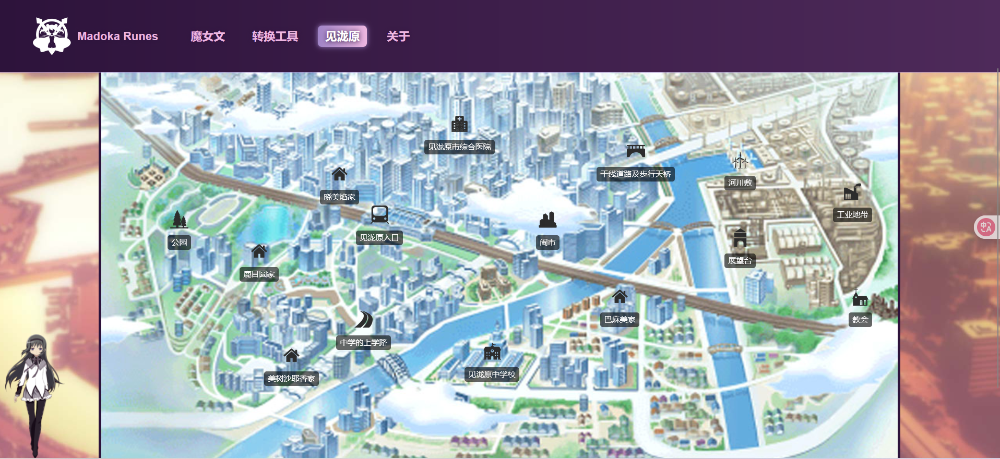
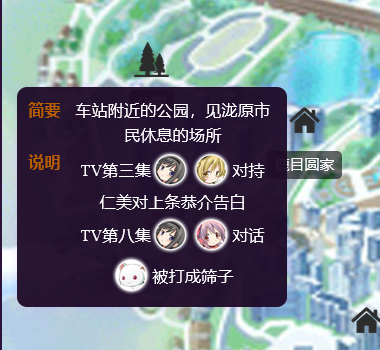

  

# Madoka-Runes 项目
欢迎来到 Madoka-Runes ！这个项目来源于今年年初补番的《魔法少女小圆》。 
真的！真的！真的很好看！ 
然后做了这个小工具网站，网站链接：[madorunes.cn](madorunes.cn) 
## 项目简介

Madoka-Runes 是一个基于《魔法少女小圆》背景的项目。主要功能包括：

- **魔女文一览表**：提供了多种魔女文字体的一览速查

  

- **魔女文转换器**：实现英文/数字/德文→多种魔女文字体的转换，并可一键下载空白背景的文字图片

  

2025/06/03更新：完全自由设置字体大小和字体颜色，手机端受不同浏览器限制严重，优先推荐电脑端

- **见泷原地图**：基于TV版《魔法少女小圆》，结合游戏《魔法少女小圆 携带版》中的资源和剧情对见泷原内的地点和事件进行标注。对可以索引到角色具体行动路线的，按集数实现路径显示。

  
  
  

- **角色互动**：电脑端有可爱的主角团看板娘，欢迎戳戳。

  

  
本页面的古代文/现代文字体使用的是 MadokaRunes（2.0属实不知道怎么用），部分字符有缺失。

## 技术相关

### 项目结构
  - `src` 目录下包含了所有的源代码文件，其中 `components` 目录用于存放 Vue 组件。
  - `docs` 目录用于存放项目的文档和资源文件。
  - `public` 目录用于存放静态资源，这些资源在构建时会被直接复制到输出目录。
### 技术栈

- **Vue 3**：用于构建用户界面，采用了 Vue 3 的 `<script setup>` 语法糖，提升了开发效率。
- **Vite**：作为构建工具，提供了快速的开发环境和热模块替换功能。
- **JavaScript**：项目的主要编程语言，负责逻辑实现和交互。
- **CSS**：用于样式设计，确保了项目的视觉效果和响应式布局。

### 地图页面功能实现

- **地图布局**：
  - 使用 HTML 和 CSS 构建地图的基本布局，包含地图容器、图像和画布元素。
  - 地图容器内嵌入了一个见泷原地图图像和一个用于绘制路径的 canvas 画布。

- **点位和路径**：
  - 地图上标记了多个点位，每个点位都有其坐标、名称和描述信息。
  - 使用 Vue.js 的 `v-for` 指令动态渲染点位，并通过样式调整其在地图上的位置。
  - 路径是由多个点位组成的，使用 canvas 绘制路径，并通过动画展示路径的流动效果。

- **交互功能**：
  - 用户可以点击地图上的点位查看详细信息。
  - 通过选择集数，用户可以查看不同集数对应的角色行动路径。
  - 使用 Vue.js 的响应式数据和事件处理机制实现用户交互。

- **动画效果**：
  - 使用 JavaScript 和 canvas API 实现路径的动态绘制和流动效果。
  - 动画通过 `requestAnimationFrame` 实现，确保流畅的用户体验。

## 参考资料

- [萌娘百科](https://zh.moegirl.org.cn/Mainpage#)
- [魔法纪录中文Wiki](https://magireco.moe/wiki/%E9%A6%96%E9%A1%B5)
- [百度贴吧](https://tieba.baidu.com/p/4525882479?pn=5#)
- [公主连结BWIKI](https://wiki.biligame.com/pcr/%E9%A6%96%E9%A1%B5)

## 碎碎念
Vue + GitHubPage的组合拳简直是神之折磨 
本来计划用CloudFlare静态部署的，结果node_modules太大塞不进去。于是试试GitHub。然后被各种路径弄了整整一天

## 仍需补充的位置信息：
（以下均为TV版内容）
  <ul>
    <li>第2集：巴麻美用缎带救下路人的废墟楼</li>
    <li>第3集：黑暗的魔女（Suleika）的使魔出现地点</li>
    <li>第8集：开头的巴士站</li>
    <li>第9集：佐仓杏子牺牲处</li>
    <li>第11集：魔女之夜出现地点</li>
  </ul>

## 致谢

希望这个项目能为所有《魔法少女小圆》的粉丝带来帮助和回忆。

> "Don't forget. always,somewhere, someone is fighting for you. ——As long as you remember her, you are not alone."

